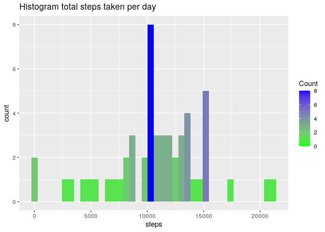
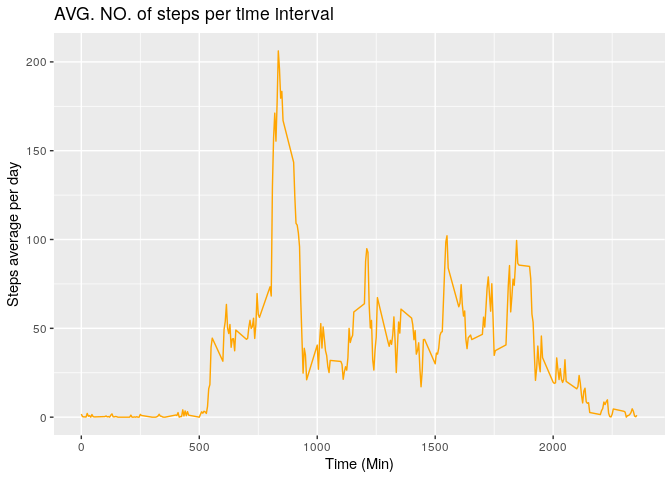
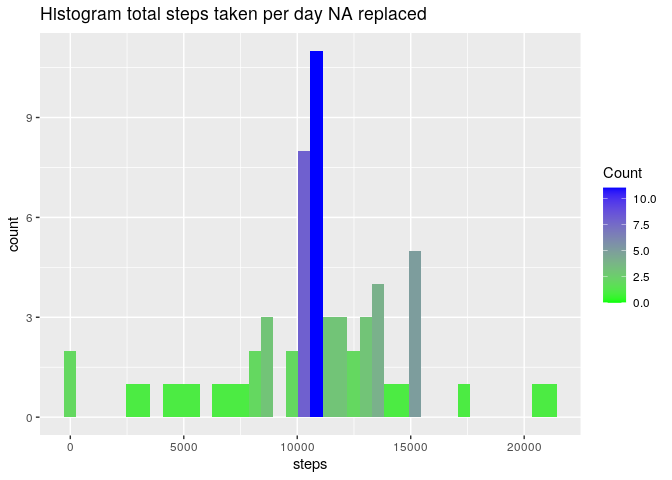
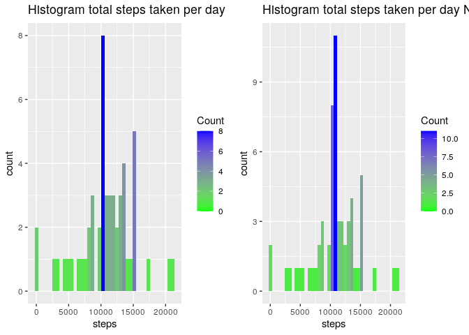
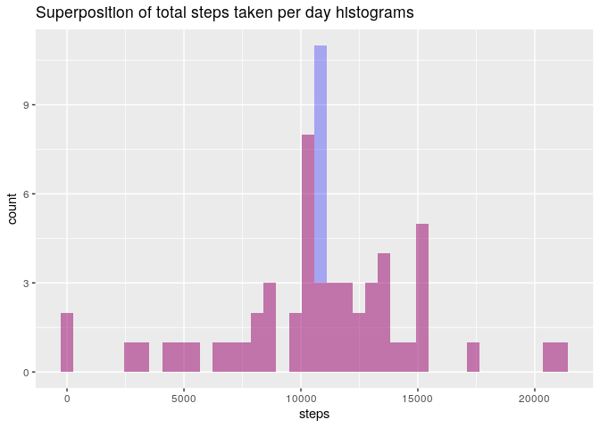
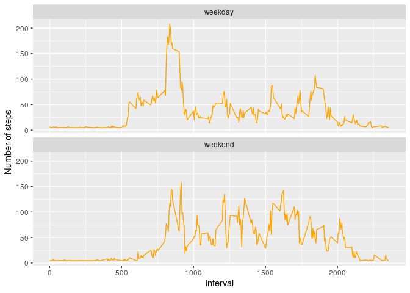

##Libraries used

```r
library(ggplot2)
library(dplyr)
```

```
## 
## Attaching package: 'dplyr'
```

```
## The following objects are masked from 'package:stats':
## 
##     filter, lag
```

```
## The following objects are masked from 'package:base':
## 
##     intersect, setdiff, setequal, union
```

```r
library(gridExtra)
```

```
## 
## Attaching package: 'gridExtra'
```

```
## The following object is masked from 'package:dplyr':
## 
##     combine
```

```r
Sys.setlocale("LC_TIME", "C")
```

```
## [1] "C"
```

## Loading and preprocessing the data
1.Load the data (i.e. \color{red}{\verb|read.csv()|}read.csv())

```r
data <- read.table(unzip("activity.zip","activity.csv"),header=T, sep=",", stringsAsFactors = FALSE)
```

2.Process/transform the data (if necessary) into a format suitable for your analysis

```r
data$date <- as.Date(data$date, format= "%Y-%m-%d")
```


## What is mean total number of steps taken per day?
1. Calculate the total number of steps taken per day

```r
stepsperday <- aggregate(steps ~ date,data , sum)
print(stepsperday)
```

```
##          date steps
## 1  2012-10-02   126
## 2  2012-10-03 11352
## 3  2012-10-04 12116
## 4  2012-10-05 13294
## 5  2012-10-06 15420
## 6  2012-10-07 11015
## 7  2012-10-09 12811
## 8  2012-10-10  9900
## 9  2012-10-11 10304
## 10 2012-10-12 17382
## 11 2012-10-13 12426
## 12 2012-10-14 15098
## 13 2012-10-15 10139
## 14 2012-10-16 15084
## 15 2012-10-17 13452
## 16 2012-10-18 10056
## 17 2012-10-19 11829
## 18 2012-10-20 10395
## 19 2012-10-21  8821
## 20 2012-10-22 13460
## 21 2012-10-23  8918
## 22 2012-10-24  8355
## 23 2012-10-25  2492
## 24 2012-10-26  6778
## 25 2012-10-27 10119
## 26 2012-10-28 11458
## 27 2012-10-29  5018
## 28 2012-10-30  9819
## 29 2012-10-31 15414
## 30 2012-11-02 10600
## 31 2012-11-03 10571
## 32 2012-11-05 10439
## 33 2012-11-06  8334
## 34 2012-11-07 12883
## 35 2012-11-08  3219
## 36 2012-11-11 12608
## 37 2012-11-12 10765
## 38 2012-11-13  7336
## 39 2012-11-15    41
## 40 2012-11-16  5441
## 41 2012-11-17 14339
## 42 2012-11-18 15110
## 43 2012-11-19  8841
## 44 2012-11-20  4472
## 45 2012-11-21 12787
## 46 2012-11-22 20427
## 47 2012-11-23 21194
## 48 2012-11-24 14478
## 49 2012-11-25 11834
## 50 2012-11-26 11162
## 51 2012-11-27 13646
## 52 2012-11-28 10183
## 53 2012-11-29  7047
```

2. If you do not understand the difference between a histogram and a barplot, research the difference between them. Make a histogram of the total number of steps taken each day

```r
g1 <- ggplot(stepsperday, aes(steps, fill=..count..)) + geom_histogram(bins=40) + scale_fill_gradient("Count", low="green", high=  "blue") + ggtitle("Histogram total steps taken per day")
g1
```

<!-- -->

3.Calculate and report the mean and median of the total number of steps taken per day

```r
mediansteps <- median(stepsperday$steps)
meansteps <- mean(stepsperday$steps)
print(paste("Mean of the total number of steps taken per day:",mediansteps))
```

```
## [1] "Mean of the total number of steps taken per day: 10765"
```

```r
print(paste("Median of the total number of steps taken per day:",as.integer(meansteps)))
```

```
## [1] "Median of the total number of steps taken per day: 10766"
```

## What is the average daily activity pattern?
Make a time series plot (i.e. \color{red}{\verb|type = "l"|}type = "l") of the 5-minute interval (x-axis) and the average number of steps taken, averaged across all days (y-axis)

```r
stepsperinterval <- aggregate(steps ~ interval,data , mean)
ggplot(stepsperinterval, aes(x=interval, y=steps))+ geom_line(col="orange")+xlab("Time (Min)")+ylab("Steps average per day")+ ggtitle("AVG. NO. of steps per time interval")
```

<!-- -->

2.Which 5-minute interval, on average across all the days in the dataset, contains the maximum number of steps?

```r
print(stepsperinterval[stepsperinterval$steps == max(stepsperinterval$steps),])
```

```
##     interval    steps
## 104      835 206.1698
```

## Imputing missing values
1.Calculate and report the total number of missing values in the dataset (i.e. the total number of rows with NAs)

```r
nas <- sum(is.na(data$steps))
print(paste("Total missing values from steps:", nas))
```

```
## [1] "Total missing values from steps: 2304"
```

2.Devise a strategy for filling in all of the missing values in the dataset. The strategy does not need to be sophisticated. For example, you could use the mean/median for that day, or the mean for that 5-minute interval, etc.
3.Create a new dataset that is equal to the original dataset but with the missing data filled in.

```r
nonastepsperday <- data %>% replace(is.na(.),mean(data$steps,na.rm=T))
nonastepsperday <- aggregate(steps ~ date,nonastepsperday , sum)
```
4.Make a histogram of the total number of steps taken each day 

```r
g2 <- ggplot(nonastepsperday, aes(steps, fill=..count..)) + geom_histogram(bins=40) + scale_fill_gradient("Count", low="green", high=  "blue") + ggtitle("Histogram total steps taken per day NA replaced")
g2
```

<!-- -->
and Calculate and report the mean and median total number of steps taken per day. 

```r
mediansteps2 <- median(nonastepsperday$steps)
meansteps2 <- mean(nonastepsperday$steps)
print(paste("Mean of the total number of steps taken per day:",as.integer(mediansteps2)))
```

```
## [1] "Mean of the total number of steps taken per day: 10766"
```

```r
print(paste("Median of the total number of steps taken per day:",as.integer(meansteps2)))
```

```
## [1] "Median of the total number of steps taken per day: 10766"
```
Do these values differ from the estimates from the first part of the assignment? 

```r
print(paste("Median differ?",mediansteps2 != mediansteps))
```

```
## [1] "Median differ? TRUE"
```

```r
print(paste("Mean differ?",meansteps2  != meansteps))
```

```
## [1] "Mean differ? FALSE"
```

What is the impact of imputing missing data on the estimates of the total daily number of steps?

```r
grid.arrange(g1,g2, nrow=1)
```

<!-- -->


```r
nonastepsperday2 <- nonastepsperday %>% mutate(fill = "NoNas")
stepsperday2 <- stepsperday %>%  mutate(fill= "Nas")
nasnonas <- rbind(nonastepsperday2, stepsperday2)
ggplot(nasnonas, aes(steps)) + geom_histogram(data=subset(nasnonas, fill=="NoNas"),bins=40, fill="blue", alpha=0.3)  + geom_histogram(data=subset(nasnonas,fill == "Nas"),bins=40, fill="red", alpha=0.3) +
        ggtitle("Superposition of total steps taken per day histograms")
```

<!-- -->
As we can see, there is some impact.


## Are there differences in activity patterns between weekdays and weekends?

1.Create a new factor variable in the dataset with two levels – “weekday” and “weekend” indicating whether a given date is a weekday or weekend day.

```r
data2 <- data %>% replace(is.na(.),mean(data$steps,na.rm=T))
data2 <- data2 %>% mutate(weekday= weekdays(date))
data2$weekday[!(weekdays(as.Date(data2$date)) %in% c('Saturday','Sunday'))] <- "weekday"
data2$weekday[(weekdays(as.Date(data2$date)) %in% c('Saturday','Sunday'))] <- "weekend"
```

2.Make a panel plot containing a time series plot (i.e. \color{red}{\verb|type = "l"|}type = "l") of the 5-minute interval (x-axis) and the average number of steps taken, averaged across all weekday days or weekend days (y-axis). See the README file in the GitHub repository to see an example of what this plot should look like using simulated data.

```r
dataweekdays <- aggregate(steps ~ interval ,data2[data2$weekday=="weekday",] , mean)
dataweekdays <- mutate(dataweekdays,weekday="weekday")
dataweekends <- aggregate(steps ~ interval ,data2[data2$weekday=="weekend",] , mean)
dataweekends <- mutate(dataweekends, weekday="weekend")
rbdata <- rbind(dataweekends, dataweekdays)
ggplot(rbdata, aes(x=interval, y=steps))+ geom_line(col="orange")+xlab("Interval")+
        ylab("Number of steps")+
        facet_wrap(~weekday, dir="v") 
```

<!-- -->


